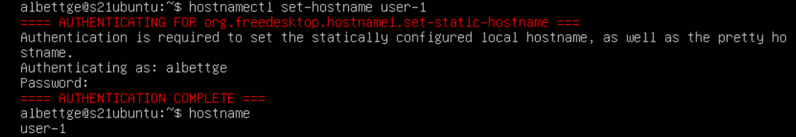
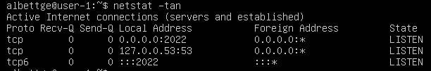

# Linux_01

## Part 1. Установка ОС

- ``Смотрим версию Ubuntu после установки `` 
 

---

## Part 2. Создание пользователя

- ``Создаём пользователя и назначаем ему группу adm`` 
 

- ``Вывод списка пользователей (новый юзер в конце списка)`` 
 

---

## Part 3. Настройка сети ОС

- ``Новое имя устройства: hostnamectl set-hostname user-1`` 
 

- ``Меняем тайм зону sudo timedatectl set-timezone Europe/Moscow`` 
 

- ``Установка net-tools`` 
- ``sudo apt install net-tools`` 

- ``Вывели информацию о сетевых интерфейсах`` 
 
- ``**lo (loopback device)** – виртуальный интерфейс, присутствующий по умолчанию в любом Linux. Он используется для отладки сетевых программ и запуска серверных приложений на локальной машине. С этим интерфейсом всегда связан адрес 127.0.0.1.`` 

- ``Получили ip от dhcp сервера`` 
  
- ``DHCP (Dynamic Host Configuration Protocol) - это протокол сетевого уровня, который позволяет устройствам автоматически получать IP-адрес, подсеть, шлюз по умолчанию и другие сетевые настройки от специального сервера, известного как DHCP-сервер.`` 

- ``Выводим внешний IP-адрес`` 
 

 - ``Выводим внутренний IP-адрес`` 
 

- ``Меняем настройки сети вимом: sudo vim /etc/netplan/00-installer-config.yaml`` 
 

- ``Сохраняем изменения, перезагружаем машину`` 
 

- ``Проверяем настройки, и успешно ли пингуются удаленные хосты 1.1.1.1`` 
 
- ``и ya.ru`` 
 

---

## Part 4. Обновление ОС

- ``Обновляем ОС`` 
 

---

## Part 5. Использование команды **sudo**

- ``Выдаем права sudo второму пользователю`` 
 
- ``Меняем hostname OS от его имени`` 
 

---

## Part 6. Установка и настройка службы времени

- ``Выводим время, часового пояса, в котором мы сейчас находимся`` 
 

---

## Part 7. Установка и использование текстовых редакторов 

- ``Используя каждый из трех редакторов - Vim, Nano, Joe, создаем файл *test_X.txt*, где X -- название редактора, в котором создан файл. В нём пишем свой никнейм, и закрываем файл с сохранением изменений.`` 
- ``$ sudo apt update; $ sudo apt install vim; $ sudo apt install nano; $ sudo apt install joe; `` 

- `` Vim. Режим редактирования - I. Для выхода из режима редактирования Esc. Для сохранения изменений Shift + Z + Z либо :wq Чтобы изменения не сохранялись :q!`` 
 

- ``Nano. Для сохранения изменений Ctrl + O > Enter. Для выхода Ctrl + X. После нажатия Ctrl+X откроется меню и на экране появится вопрос Save modified buffer?. Чтобы выйти без сохранения изменений, нажимаем клавишу N`` 
 

- ``Joe. Для выхода с сохранением из Joe Ctrl + K затем X.`` 
 

- ``Используя каждый из трех выбранных редакторов, открываем файл на редактирование, редактируем файл, заменив никнейм на строку "21 School 21", закрываем файл без сохранения изменений.`` 

- ``Vim`` 
 

- ``Nano`` 
 

- ``Joe`` 
 
- ``Для выхода без сохранения можно также использовать комбинацию клавиш Ctrl+K и затем Q (символ "Q") для выхода из редактора. Если в файл были внесены изменения, Joe спросит: (Save modified buffer?). Чтобы выйти без сохранения изменений, нажмите клавишу N (символ 'N'). `` 

- ``Используя каждый из трех выбранных редакторов, отредактируем файл ещё раз, а затем освоим функции поиска по содержимому файла (слово) и замены слова на любое другое.`` 

- ``В Vim для поиска слова в файле мы можем использовать команду /<word>`` 
 

- ``После того, как Vim найдет первое совпадение, можно заменить это слово на другое с помощью команды :%s/old_word/new_word/g, где old_word - заменяемое, а new_word - заменяющее`` 
 

- ``Ctrl + W, чтобы открыть поиск по содержимому файла. Введите слово или фразу, которую вы хотите найти, и нажмите Enter.`` 
 

- ``Чтобы заменить найденное слово или фразу на другое, используем комбинацию Alt + R или Option + R`` 
 
- ``Затем вводим новое слово или фразу. Для замены - Enter.`` 
 

- ``Нажимаем Ctrl + K, затем клавишу F. Откроется строка поиска в нижней части экрана``
 

- ``Для замены нажимаем клавишу Ctrl + K, затем клавишу F. Откроется строка поиска в нижней части экрана.`` 
 
- ``Вводим искомое слово, затем Enter. Joe предложит выбор, нажимаем R для замены слова, затем вводим новое слово.`` 
- ``Enter, чтобы заменить найденные совпадения.`` 
 

---

## Part 8. Установка и базовая настройка сервиса **SSHD**

- ``Сначала устанавливаем службу SSHD: $ sudo apt-get install ssh`` 

- ``Затем настраиваем автозапуск служб при перезапуске системы `` 
 

- ``Переконфигурируем службу SSHd на порт 2022`` 
 

- ``Перезапускаем систему : $ systemctl restart sshd`` 

- ``Используя команду ps, показываем наличие процесса sshd`` 
 
- ``* ps (показывает запущенные процессы, выполняемые пользователем в окне терминала); * ps -e или ps -A (Для просмотра всех запущенных процессов); * ps -d (Чтобы показать все процессы,кроме лидеров сессий); * ps -d -N (Вы можете инвертировать вывод с помощью переключателя -N. Например, если я хочу отобразить только лидеров сессий) * ps T (показывает только процессы,связанные с этим терминалом); * ps r (посмотреть все запущенные (running) процессы); * ps -p 'pid' (если вы знаете PID процесса, вы можете просто использовать следующую команду, чтобы вывести процесс с этим 'pid'); * ps -p 'pid1' 'pid2' * ps U 'userlist' (найти все процессы, выполняемые определенным пользователем); * ps -ef (получить полный список).`` 

- ``Перезагружаем систему : $ reboot;``  
 
- ``Выводим команду: $ netstat -tan;``  
 
- `` Флаги для netstat : -t (--tcp) отображает только tcp соединения; -a (--all) отображает все активные TCP соединения; -n (--numeric) отображает активные TCP соединения с адресами и номерами портов в числовом формате; Proto: имя протокола (протокол TCP или протокол UDP); recv-Q: очередь на получение сети; end-Q: очередь на отправку сети; Local Address адрес локального компьютера и номер используемого порта; Foreign Address адрес и номер удаленного компьютера, к которому подключен сокет; State состояние сокета; 0.0.0.0 означает IP-адрес локального компьютера.``  

---

## Part 9. Установка и использование утилит **top**, **htop**

- ``top``  
 
- ``Время работы  - 15 минут. Количество авторизованных пользователей - 1. Общая нагрузка на систему - 0.00 0.00 0.00. Общее количество процессов - 94. Загрузка процессора - 0.0%. Загрузка памяти - 145/1971мб. PID процесса, использующего больше всего памяти - 1.   PID процесса, занимающего больше всего процессорного времени - 1091`` 

- ``htop``  

- ``Sort by PID``  
 

- ``Sort by Percent CPU``  
 

- ``Sort by Percent MEM``  
 

- ``Sort by Percent TIME``  
 

- ``Filtered by sshd``  
 

- ``Searched by syslog``  
 

- ``С добавленным выводом hostname, clock и uptime``  
- ``Перенаправление в файл``  
 
- ``Вывод из файла``  
 

---

## Part 10. Использование утилиты **fdisk**

- ``$ sudo fdisk -l; $ swapon`` 
 
- ``Имя диска - VBOX HARDDISK, Размер диска - 30 GiB, Количество секторов - 62914560, Размер свопа - 1G`` 

---

## Part 11. Использование утилиты **df** 

- ``$ df`` 
 
- ``df Отчет для корневого раздела (/): * размер раздела - 8408452 Кбайт; * размер занятого пространства - 5099468 Кбайт; * размер свободного пространства - 8489432 Кбайт; * процент использования - 38%. ****  
 
- ``df -Th Отчет для корневого раздела (/): * размер раздела - 14 Гбайт; * размер занятого пространства - 4,9 Г; * размер свободного пространства - 8.1 Г; * процент использования - 38%; * тип файловой системы для раздела - ext4.`` 

---

## Part 12. Использование утилиты **du**

- ``$ sudo du -sh /var/log /var /home `` 
 
- ``$ sudo du -s --block-size=1 /var/log /var /home``  
 

- ``$ sudo du -sh /var/log/*``  
 

---

## Part 13. Установка и использование утилиты **ncdu**

- ``Устанавливаем ncdu``  
- ``sudo apt install ncdu``  

- ``Выводим размер папки /home``  
 

- ``Выводим размер папки /var``  
 

- ``Выводим размер папки /var/log.``  
 

---

## Part 14. Работа с системными журналами

- ``$ sudo nano /var/log/auth.log``  
 
- ``* Последняя успешная авторизация: Aug 27 12:24:48; * Имя пользователя: albettge; * Метод входа: pam-unix.``  
- ``$ sudo nano /var/log/dmesg;  
 
- `` $ sudo nano /var/log/syslog;  
 
- `` $ sudo systemctl restart ssh; $ cat /var/log/syslog `` 
 
- ``Скрин с сообщением о рестарте службы``  

---

## Part 15. Использование планировщика заданий **CRON**

- `` Используя планировщик заданий, запускаем команду uptime через каждые 2 минуты: $  sudo crontab -e `` 
 

- `` Скрин со списком текущих заданий для CRON после удаления`` 
 
- `` Нет текущих задач`` 
 

---

